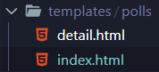

# 첫 번째 장고 앱 작성하기, part 2

## DB 설치하기

> Django는 기본적으로 SQLite를 사용하도록 구성 되어 있다. 기본 제공 데이터베이스고 나중에 실 프로젝트 할때는 좀 더 확장석 있는 데이터 베이스를 사용하는 것이 좋다.[DB바인딩](https://docs.djangoproject.com/ko/3.2/topics/install/#database-installation)
>
> 후 DATABASES default항목값 ENGINE, NAME 등 키 값 성정하기.[DATABASES](https://docs.djangoproject.com/ko/3.2/ref/settings/#std:setting-DATABASES)
>
> SQLite는 DB파일이 필요할 때마다 자동생성되나 타 DB는 DB 생성 따로 해줄 것.


* my-site/settings.py에서 TIME_ZONE값 설정 할 것.
  * 기본값은 USE_TZ이므로 검색해가서 수동설정할 것.


```python
INSTALLED_APPS = [
    'polls.apps.PollsConfig',
    'django.contrib.admin',
    'django.contrib.auth',
    'django.contrib.contenttypes',
    'django.contrib.sessions',
    'django.contrib.messages',
    'django.contrib.staticfiles',
]
```

세팅창 기본제공 App들이 있는데 다음과 같음. 

* admin : 관리용 사이트
* auth : 인증 시스템
* contenttypes : 컨텐츠 타입을 위한 프레임워크
* sessions : 세션 프레임워크
* messages : 메세징 프레임워크
* staticfiles : 정적 파일을 관리하는 프레임워크
* polls줄은 앱을 현재 프로젝트에 포함시키겠다는 구문.


```bash
# settings.py의 DB설정과 마이그레이션에 따라 DB테이블을 자동생성해준다.
python manage.py migrate
# SHOW TABLES;.schemaSELECT TABLE_NAME FROM USER_TABLES;
```


## 모델 만들기

* 모델이란 부가적인 메타데이터를 가진 데이터베이스의 구조(layout)
* DB의 필드와 동작을 포함한다.
* DRY원칙에 따른 정규화를 추구한다.

- [객체생성](https://docs.djangoproject.com/ko/3.2/ref/models/instances/#django.db.models.Model)

```python
import datetime

from django.db import models
from django.utils import timezone


class Question(models.Model):

    question_text = models.CharField(max_length=200)
    pub_date = models.DateTimeField('date published')
	# 객체 표현을 위한 str
    def __str__(self):
        return self.question_text
    
    def was_published_recently(self):
        return self.pub_date >= timezone.now() - datetime.timedelta(days=1)

# 관계설정을 위한 
# 각각의 Choice가 하나의 Question에 대응.
# CASCADE는 계산식 삭제 형식.
class Choice(models.Model):
    question = models.ForeignKey(Question, on_delete=models.CASCADE)
    choice_text = models.CharField(max_length=200)
    votes = models.IntegerField(default=0)
    
    def __str__(self):
        return self.choice_text

```

* DB의 각 필드는 Field클래스의 인스턴스로 표현됨.

* CharField 는 문자필드(필수인수max_length), DateTimeField는 날짜와 시간 필드.
* 이는 Django에게 각 필드가 어떤 자료형을 가질것인지를 선언함.

* **기계가 읽기 좋은 형식과 사람이 읽기좋은 형식에 대해 공부해보기.**
* [Foreign Key](https://docs.djangoproject.com/ko/3.2/ref/models/fields/#django.db.models.ForeignKey)


## 모델 활성화

```bash
$ python manage.py makemigrations polls
```

로 CREATE TABLE함.

> migration은 Django가 모델과 DB스키마에 대한 변경사항을 저장하는 방법.
>
> migrations에 저장된느 파일이고 수동으로 조정할 수 있음.

**migrate와 sqlmigrate 명령에 대해 공부해보기**


```python
python manage.py sqlmigrate polls 0001
```

을 통해 가상으로 DB migration을 화면에 인쇄해줌.

```bash
python manage.py migrate
```

아직 적용되지 않은 마이그레이션을 모두 수집해 이를 실행함 

* 장고는  `django_migrations`테이블을 두어 migtation적용 여부를 추적함.
* 모델에서의 변경사항들과 DB스키마의 동기화가 이루어짐.
* 동작중인 DB를 자료 손실없이 업데이트하는데 최적화 된 강력한 기능.
* 3가지 절차를 기억
  * models.py에서 모델 변경
  * [python manage.py makemigrations](https://docs.djangoproject.com/ko/3.2/ref/django-admin/#django-admin-makemigrations)를 통해 변경사항에 대한 migration생성
  * [python manage.py migrate](https://docs.djangoproject.com/ko/3.2/ref/django-admin/#django-admin-migrate) 를 통해 변경사항을 데이터베이스에 적용

* 만드는 명령과 적용하는 명령이 분리된 것은 버전관리 시스템에 migration을 커밋할 수 있도록 하기 위함.(개발의 용이성을 위함)


## API 다루기

```bash
python manage.py shell
```

* manage.py에서 세팅을 다룸.

* [쿼리만들기](https://docs.djangoproject.com/ko/3.2/topics/db/queries/)


## 관리자 생성

```bash
python manage.py createsuperuser
Username: admin
Email address: admin@example.com
Password: **********
Password (again): *********
```

* http://127.0.0.1:8000/admin/ 으로 관리화면 접근
* admin.py에서 괸리 인덱스를 추가시킬 수 있음.

```python
from django.contrib import admin

from .models import Question

admin.site.register(Question)
```

* CRUD의 수행이 가능.


# 첫 번째 장고 앱 작성하기, part 3

* view는 장고가 일반적으로 특정 기능과 템플릿을 제공하는 웹 페이지의 종류.


## 뷰 

* 요청된 페이지의 내용이 담긴 HttpResponse의 반환
* Http404같은 예외 발생
* 둘 중 하나를 하도록 설계.

```python
# from django import template
from django.http import HttpResponse
# from django.template import loader
# 숏컷으로 render 사용. template에 context를 채워넣어 표현한 경과를 HttpResponse객체와 함꼐 돌려주는 구문. render
from django.shortcuts import render,get_object_or_404
from django.http import Http404

from .models import Question

# def index(request):
#     latest_question_list = Question.objects.order_by('-pub_date')[:5]
#     output = ', '.join([q.question_text for q in latest_question_list])
#     return HttpResponse(output)

def index(request):
    latest_question_list = Question.objects.order_by('-pub_date')[:5]
    # template = loader.get_template('polls/index.html')
    context = {
        'latest_question_list': latest_question_list,
    }
    # return HttpResponse(template.render(context, request))
    return render(request, 'polls/index.html',context)

def detail(request, question_id):
    # try:
    #     question = Question.objects.get(pk=question_id)
    # except Question.DoesNotExist:
    #     raise Http404("Question doex not exist")
    question = get_object_or_404(Question, pk=question_id)
    return render(request, 'polls/detail.html',{'question':question})

def results(request, question_id):
    response = f"I'm the results of question {question_id}"
    return HttpResponse(response)

def vote(request, question_id):
    return HttpResponse(f"You vote this Q {question_id}")
```


## URLS

* 라우팅.
* namespace :  app_name을 추가해 각각의 App들을 구별하기 위함.
* html url을 app_name을 통한 id를 달아줘 라우팅함.

```python
from django.urls import path

from . import views

app_name = 'polls'
urlpatterns = [
    path('', views.index, name='index'),
    path('<int:question_id>/', views.index, name='index'),
    path('<int:question_id>/', views.detail, name='detail'),
    path('<int:question_id>/results/', views.results, name='results'),
    path('<int:question_id>/vote/', views.vote, name='vote'),
    
]
```


## 템플릿



네임 스페이싱을 통해 올바른 경로를 가리키도록 하기 위함.


## Shortcut

```python
from django.shortcuts import get_object_or_404, render

from .models import Question
# ...
def detail(request, question_id):
    question = get_object_or_404(Question, pk=question_id)
    return render(request, 'polls/detail.html', {'question': question})
```


## 차후 공부할 것.

* [Django 설계 철학](https://docs.djangoproject.com/ko/3.2/misc/design-philosophies/#dry)

* [HttpRequest, Response객체](https://docs.djangoproject.com/ko/3.2/ref/request-response/#django.http.HttpResponse)
* [Field API reference](https://docs.djangoproject.com/ko/3.2/ref/models/fields/#django.db.models.Field)
* [TEMPLATES](https://docs.djangoproject.com/ko/3.2/ref/settings/#std:setting-TEMPLATES)
* [shortcut 패키지](https://docs.djangoproject.com/ko/3.2/topics/http/shortcuts/#django.shortcuts.render)
* [built-in template tags and filters](https://docs.djangoproject.com/ko/3.2/ref/templates/builtins/#std:templatetag-for)

* [fields](https://docs.djangoproject.com/ko/3.2/ref/models/fields/#django.db.models.CharField)

* [migrate](https://docs.djangoproject.com/ko/3.2/ref/django-admin/#django-admin-migrate)

* [sqlmigrate](https://docs.djangoproject.com/ko/3.2/ref/django-admin/#django-admin-sqlmigrate)

* [django admin](https://docs.djangoproject.com/ko/3.2/ref/django-admin/)

* [object ref](https://docs.djangoproject.com/ko/3.2/ref/models/relations/)

* [make query](https://docs.djangoproject.com/ko/3.2/topics/db/queries/)

* [installed app관리](https://docs.djangoproject.com/ko/3.2/ref/settings/#std:setting-INSTALLED_APPS)

* [서비스환경DB구동](https://docs.djangoproject.com/ko/3.2/topics/install/#database-installation)

* [ㄴ2](https://docs.djangoproject.com/ko/3.2/ref/settings/#std:setting-DATABASES)

* [URL dispatcher장고의 요청처리](https://docs.djangoproject.com/ko/3.2/topics/http/urls/)

* [COOL URI](https://www.w3.org/Provider/Style/URI)

* [path,include](https://docs.djangoproject.com/ko/3.2/ref/urls/#django.urls.include)

