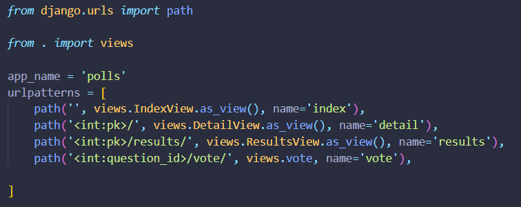

# 첫 번째 장고 앱 작성하기, part 4

* 양식 처리 및 코드 축소

## Write a minimal form

* HTML from 추가(question에 대한 radio box)
* vote 객체 구현
* 결과지(results) 템플릿 view


* 결국 {}문법은 jsx문법 처럼 js 코드를 넣기 위한 문법.


## 제너릭 뷰 사용하기: 적은 코드가 더 좋습니다

* 일반적인 경우(URL에서 전달된 매개변수에 따라 DB에서 DB를 가져오고 템플릿을 로드하고 렌더링된 템플릿을 리턴하는 경우)를 위해 generic view라는 shortcut을 제공함.
  * URLconf 수정
  * 불필요한 오래된 view 삭제
  * 장고의 generic view를 기반으로 새로운 뷰를 도입.

### URLconf 수정



* 패턴 경로 문자열에서 일치하는 패턴 이름들이 question_id -> pk로 수정됨.

### views 수정


* from django.views import generic
* 제네릭 뷰의 일반적인 객체를 상속받아 수정
* Listview, DetailView..
* 위에서 아래로 바뀜.

# 첫 번째 장고 앱 작성하기, part 5

* 자동화된 테스트 작성.

## 자동화된 테스트 소개

### 자동화된 테스트란 무엇입니까?

* 테스트는 다양한 수준에서 작동합니다.(4수준) 

* 유닛테스트 : 특정 모델 메서드는 예상대로 값을 반환합니까?

* E2E테스트 : 사이트에서 사용자 입력 시퀀스가 원하는 결과를 생성합니까?
* 테스트 자동화는 한 번 작성한 이후에 앱을 변경할 때 수동 테스트를 수행하지 않아도 원래 의도대로 코드가 동작하는지 확인 가능

* 테스트 자동화는 처음엔 어렵고 복잡할지 모르나 결국 수정과 에러를 적게하는건 테스트코드

  > 과거엔 아키텍처 설계를 통해 시간과 비용을 절약했다면 이제는 테스트코드와 예외처리를 통해 그것이 이루어짐.

#### 테스트를 통해 시간을 절약

* 특정 시점까지는 제대로 작동하는지 확인하는 테스트로 충분. 

* 하지만 더 정교한 App에서는 구성 요소간 복잡한 상호 작용이있을 수 있음.

* 자동화된 테스트는 몇 초만에 무언가가 잘못되어도 예기치 않은 동작을 일으키는 코드를 식별해내는데 도움을 줌.(자동 디버깅)

* 코드가 제대로 작동하고 있을 때 테스트를 작성하는 것은 생산성을 저하한다고 생각할 수 있다.

* 하지만 App을 수동으로 테스트하거나 새로 발견된 문제의 원인을 확인하는 데 많은 시간을 투자하는 것보다 훨씬 더 효과적이다.

#### 테스트는 단순 문제 식별이 아닌 예방

* 테스트가 없으면 어플리케이션의 목적 또는 의도 된 동작이 다소 불투명 할 수 있다.
* 심지어 자신의 코드 일 때도, 정확히 무엇을하고 있는지 알아 내려고 노력해야 할 수도 있다.

* 테스트는 불투명함을 바꾼다. 내부에서 어떤 것이 잘못 될 때, 그것이 잘못되었다는 것을 깨닫지 못해도, 잘못된 부분을 밝혀준다.
* 잘못된 부분을 검출시켜 방향성이 틀어지는 것을 막는다.

#### 테스트가 코드를 더 매력적으로 만듦.

* 당신은 훌륭한 소프트웨어를 만들었을지 모르지만 테스트가 부족하기 때문에 많은 다른 개발자들이 그것을 보기를 거부한다는 것을 알게 될 것입니다. 테스트가 없으면 그들은 그것을 신뢰하지 않을 것입니다. Django의 원래 개발자 중 한 명인 Jacob Kaplan-Moss는 《테스트 없는 코드는 의도적으로 망가진 것입니다.》

* 테스트 작성을 시작해야하는 또다른 이유는 다른 개발자들이 당신의 소프트웨어를 사용하는것을 진지하게 고려하기 전에 테스트 코드를 보기를 원하기 때문입니다.

  > 테스트코드는 신뢰성과 밀접한 관련이 있다. 신뢰성은 곧 품질.

#### 즉 테스트는 팀이 함께 일하는 것을 돕는다

* 테스트는 동료가 실수로 코드를 손상시키지 않는다는 것을 보증한다


## 기초 테스팅 전략

[테스트 주도 개발](https://en.wikipedia.org/wiki/Test-driven_development) : 문제를 설명한 다음 이를 해결하기 위한 코드를 생성

* 초보자도 지금 당장 시작해야함.

## 첫 번째 테스트 작성하기


### 버그를 노출하는 테스트 만들기

* shell에서 수행한 작업은 자동화된 테스트에서 수행할 수 있는 작업이므로 자동화된 테스트로 바꾸도록 하자.
* 테스트파일은 tests.py에 모아둠.
* 테스트 시스템은 test로 시작하는 파일에서 테스트를 자동으로 서칭함.


* 현시점, 과거, 미래의 시간 질의에 대한 테스트코드.

## 뷰 테스트

* 현재 pub_date가 미래에 있는 질문까지 포함해 게시하는 버그가 있음.

### 뷰에 대한 테스트

### 장고 테스트 클라이언트

* 장고는 client를 시뮬레이션 하기 위해 테스트 클라이언트 클래스 Client제공.

```bash
python manage.py shell
```

```shell
from django.test.utils import setup_test_environment
setup_test_environment()
```

쉘에 테스트환경 구성

* setup_test_environment()


* 질문 생성 함수인 create_question은 테스트 과정 중 설문을 생성하는 부분에서 반복 사용한다.
* `test_no_questions`는 질문을 생성하지는 않지만 《사용가능한 투표가 없습니다.》라는 메시지 와 `latest_question_list`가 비어 있음을 확인한다.
* django.test.TestCase클래스는 몇 가지 추가적인 선언 메소드를 제공하는데 이 예제에서 우리는 assertContains()와 assertQuerysetEqual()을 사용한다.
* `test_past_question`에서 우리는 질문을 생성하고 그 질문이 리스트에 나타나는지 확인한다.
* `test_future_question`에서 우리는 미래의 `pub_date`로 질문을 만들 것이다. 데이터베이스는 각 테스트 메소드마다 재설정되기 때문에 첫 번째 질문은 더 이상 존재하지 않으므로 인덱스에 질문이 없어야 한다.
* 요약하면 사이트에서 관리자 입력 및 사용자 경험에 대한 이야기를 하는 테스트를 만들었고, 모든 상태와 시스템 상태의 모든 새로운 변경 사항에 대해 예상하는 결과가 출력되는지 확인하는 테스팅이다.


### DetailView 테스트


* 질의시점에 대한 테스팅.


### 더 많은 테스트 아이디어

- get_queryset메소드를 ResultsView에 추가하고 그 뷰에 대한 새로운 테스트 클래스를 생성하는 것을 반복한다.
- 테스트를 추가하면서 다른 방법으로 애플리케이션을 개선 할 수도 있다. 예를 들어, 선택지가 없는 사이트에 설문을 게시 할 수 있다는 것은 말이 안된다. 그래서 뷰는 이를 확인하고 그러한 질문을 배제 해야한다. 우리의 테스트는 **선택사항이 없는 설문**을 생성 한 다음, 실제로 게시되지 않는지 테스트하고, 선택사항이 있는 설문을 작성하고 게시 여부를 테스트할 수 있다.
- 다시 말하면 소프트웨어를 추가하기 위해 필요한 것은 무엇이든 테스트를 수반해야한다.
- 먼저 테스트를 작성한 다음 코드가 테스트를 통과하게 만들 것인지, 아니면 먼저 코드에서 로직을 처리 한 다음 이를 증명할 것인지를 정해 테스트를 작성해야한다.

## 테스트 할 때는 많이 할 수록 좋다.

- 너무 많은 테스트 코드들을 보고 관리하기 힘들만큼 너무 많아 지는것은 아닌가 생각할수도 있다.
- 우리의 테스트가 통제 불능으로 성장하고있는 것처럼 보일 수 있다. 이 속도라면 곧 우리의 어플리케이션에서 보다 우리의 테스트의 코드가 더 많아질 것이고, 나머지 코드의 우아한 간결함과 비교했을 때, 반복하는 것은 보기 좋지 않다.

> 테스트코드가 비대해지는것은 중요하지 않다.
> 테스트 코드들은 늘어나게 해야한다.
> 대부분의 경우 테스트를 한 번 작성한 다음 신경을 끄게 되는데
> 그래도 이 테스트 코드의 유용한 기능들은 프로그램을 개발하는 동안 계속 해서 작동할 것이다.

- 때로는 테스트를 업데이트해야한다. 우리가 `선택지`를 가진 `설문들`만 출력되도록 뷰를 수정한다고 가정하면 이 경우 기존 테스트 중 상당수가 실패 텐데 테스트 결과를 최신으로 유지하기 위해 어떤 테스트를 수정해야하는지 정확하게 알려주므로 테스트가 스스로의 코드를 돌아보는데 도움이된다.
- 최악의 경우 개발을 계속할 때 중복되는 테스트가 있을 수 있다. 그것은 문제가 아니다. **테스팅에서 반복하는 것은 좋은 일이다.**
- 테스트들이 현명하게 배열되어있는 한 관리가 어려워지지 않을 것입니다. 그에대한 방법론
  - 각 모델이나 뷰에 대한 별도의 `TestClass`
  - 테스트하려는 각 조건 집합에 대해 분리된 테스트 방법
  - 기능를 설명하는 테스트 메소드 이름

## 추가 테스팅

- 수행 한 테스트에서는 모델의 내부 로직과 뷰에서 정보를 게시하는 방법을 다루었지만
- [Selenium](https://www.selenium.dev/) 같은 《브라우저 내》 프레임 워크를 사용하여 HTML이 브라우저에서 실제로 렌더링되는 방식을 테스트 할 수 있다. 이러한 도구를 사용하면 장고 코드의 동작뿐만 아니라 JavaScript도 확인할 수 있다.
- 테스트는 브라우저를 시작하고 인간이 그것을 다루는 것처럼 사이트와 상호 작용 것은 매우 중요하다
- Django에는 [LiveServerTestCase](https://docs.djangoproject.com/ko/3.2/topics/testing/tools/#django.test.LiveServerTestCase)가 포함되어있어 Selenium과 같은 도구와 쉽게 통합할 수 있게 해준다.
- 복잡한 어플리케이션을 사용하는 경우 [연속적으로 통합](https://en.wikipedia.org/wiki/Continuous_integration)하기 위해 모든 커밋마다 자동으로 테스트를 실행하여 품질 제어가 적어도 부분적으로 자동화되도록 만들 수 있다.
- 어플리케이션에서 테스트되지 않은 부분을 탐지하는 좋은 방법은 코드 커버리지를 확인하는 것인데 이것은 깨지기 쉬운 코드나 심지어는 죽은 코드를 식별하는 데도 도움이 된다.
- 코드를 테스트 할 수 없다는 것은 대개 코드가 리팩터링해야하거나 제거해야 함을 의미하고 커버리지는 죽은 코드를 확인하는 데 도움이된다. [Integration with coverage.py](https://docs.djangoproject.com/ko/3.2/topics/testing/advanced/#topics-testing-code-coverage) 참조
- [장고 테스트](https://docs.djangoproject.com/ko/3.2/topics/testing/)는 테스트에 대한 포괄적인 정보를 제공


