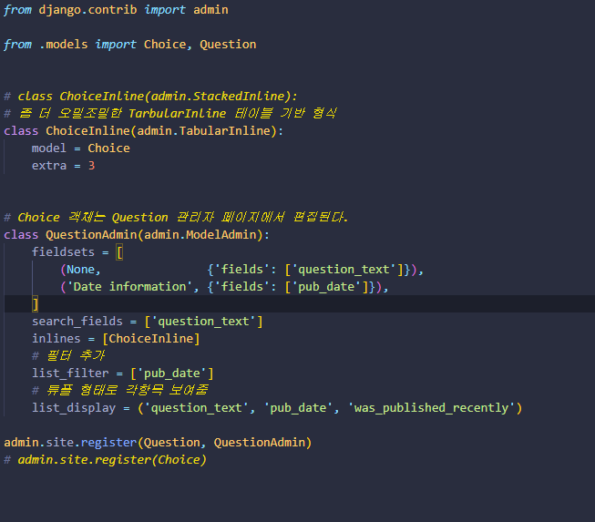
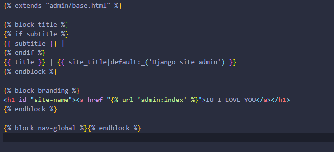
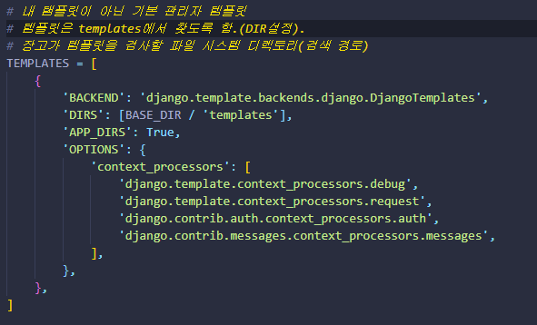

# 첫번째 장고 앱 작성하기, part 6

* 앱의 모양과 느낌을 원하는대로 바꿔보세요

---

정적파일을 저장할 static 리렉토리

* 디렉토리를 지정함은 네임스페이싱을 통해 파일을 구별짓기를 원한다는 의미이다.(이름이 동일한 다른파일과)

```html


<link rel="stylesheet" type="text/css" href="">
```

static 탬플릿 태그는 정적파일의 절대경로 URL을 생성한다.

---

## 배경 이미지 추가하기.


images 서브 디렉토리 추가

```css
* {
    padding: 0;
    margin: 0;
    box-sizing: border-box;
}

ul {
    font-family: 'Open Sans', sans-serif;
    font-family: 'Roboto', sans-serif;
    background-color: rgba(255, 255, 255, 0.822);
    width: 300px;
    height: 300px;
    border-radius: 100%;
    position: fixed;
    top: 50%;
    left: 70%;
    transform: translate(-50%,-50%);
    text-align: center;
    padding-top: 4%;
}

h1 a {
    text-decoration: none;
    color: rgb(102, 19, 102);
    font-family: 'Indie Flower', cursive;
}

.background__img {
    height: 95vh;
    background-image: linear-gradient(
      to right bottom,
      rgba(238, 132, 229, 0.801),
      rgba(167, 68, 187, 0.808)
    ), url("images/iu.jpg");
    background-size: cover;
    background-position: top;
    clip-path: polygon(0 0, 100% 0, 100% 75vh, 0 100%);
    position: relative;
}

```

---

# 첫번째 장고 앱 작성하기, part 7

## 관리자 폼 커스터마이징

수정 폼의 필드를 재정렬하여 이것이 작동하는 법을 보겠습니다. `admin.site.register(Question)` 줄을 다음과 같이 바꾸세요:

```python
from django.contrib import admin

from .models import Question


class QuestionAdmin(admin.ModelAdmin):
    fields = ['pub_date', 'question_text']

admin.site.register(Question, QuestionAdmin)
```

모델의 관리자 옵션을 변경해야 할 때마다 이 패턴 – 모델 어드민 클래스를 만든 다음, `admin.site.register()`에 두 번째 인수로 전달합니다 – 을 따라하면 됩니다.

수십 개의 필드가 있는 폼에 관해서는 폼을 fieldset으로 분할하는 것이 좋습니다.

```python
from django.contrib import admin

from .models import Question


class QuestionAdmin(admin.ModelAdmin):
    fieldsets = [
        (None,               {'fields': ['question_text']}),
        ('Date information', {'fields': ['pub_date']}),
    ]

admin.site.register(Question, QuestionAdmin)
```

[fieldsets](https://docs.djangoproject.com/ko/3.2/ref/contrib/admin/#django.contrib.admin.ModelAdmin.fieldsets)의 각 튜플의 첫 번째 요소는 fieldset의 제목입니다. 우리의 폼이 다음과 같이 변했네요.

## 관련 객체 추가



* Question 필드는 데이터베이스의 모든 질문을 포함하는 select box. 
* Django는 ForeignKey가 admin에서 `<select>`로 표현되어야 함을 알고 있다. 

* `ForeignKey` 관계를 가진 모든 객체는 Question옆의 Add Another링크가 붙는다.
* Add Another를 클릭하면 Add question 폼이 나타난다. 

* Choice-inline -> Question을 생성할때 여러개의 choice객체를추가시켜줌

* `StackedInline` 대신에 `TabularInline`을 사용하면, 관련된 객체는 좀 더 조밀하고 테이블 기반 형식으로 표시 돼 리스트가 늘어나 가독성이 안좋아 지는 것을 막는다.

* list_display 어드민 옵션을 사용해 튜플형태로 각 항목 상태 보여줌. - display decorator 공부

* list_filter = ['pub_date'] 로 필터 추가해 pub_date 필드로 필터링 할 수 있도록 함

* search_fields = ['question_text'] 로 검색창 추가

*  장고는 `question_text` 필드를 검색
* `LIKE` 쿼리를 사용하기 때문에 검색 필드의 수를 적당한 수로 제한하면 데이터베이스가 검색을 더 쉽게 할 수 있다.

* 추가 기능
  * 변경 목록이 자동 페이징 기능: 기본값은 페이지 당 100 개의 항목을 표시
  * [변경 목록 페이지내이션](https://docs.djangoproject.com/ko/3.2/ref/contrib/admin/#django.contrib.admin.ModelAdmin.list_per_page)
  * [검색 상자](https://docs.djangoproject.com/ko/3.2/ref/contrib/admin/#django.contrib.admin.ModelAdmin.search_fields)
  * [필터](https://docs.djangoproject.com/ko/3.2/ref/contrib/admin/#django.contrib.admin.ModelAdmin.list_filter) 
  * [날짜-계층구조](https://docs.djangoproject.com/ko/3.2/ref/contrib/admin/#django.contrib.admin.ModelAdmin.date_hierarchy)
  * [컬럼-헤더-정렬](https://docs.djangoproject.com/ko/3.2/ref/contrib/admin/#django.contrib.admin.ModelAdmin.list_display)
  * [검색 상자](https://docs.djangoproject.com/ko/3.2/ref/contrib/admin/#django.contrib.admin.ModelAdmin.search_fields)
  * [필터](https://docs.djangoproject.com/ko/3.2/ref/contrib/admin/#django.contrib.admin.ModelAdmin.list_filter)
  * [날짜-계층구조](https://docs.djangoproject.com/ko/3.2/ref/contrib/admin/#django.contrib.admin.ModelAdmin.date_hierarchy)
  * [컬럼-헤더-정렬](https://docs.djangoproject.com/ko/3.2/ref/contrib/admin/#django.contrib.admin.ModelAdmin.list_display)

---

## 관리자 룩앤필 커스터마이징[¶](https://docs.djangoproject.com/ko/3.2/intro/tutorial07/#customize-the-admin-look-and-feel)



```bash
$ python -c "import django; print(django.__path__)"
```

* 위 코드로 장고 소스파일 위치 찾고 base template 찾기.
* 실제 프로젝트에서는 [django.contrib.admin.AdminSite.site_header](https://docs.djangoproject.com/ko/3.2/ref/contrib/admin/#django.contrib.admin.AdminSite.site_header) 속성을 사용하여 이 개별 커스터마이징
* 장고는 모든 커스텀을 보장한다 수정이 필요한 소스파일을 개별 프로젝트 template으로 복사해와 수정하면 프로젝트 내에 있는 template부터 탐색하기 때문에 적용된다.
* 물론 개인 폴더에 찾을 template이 없다면 sub directory인 django.contrib.admin에서 찾게된다.
* Django가 템플릿을 찾는 방법에 대한 자세한 정보는 [템플릿 로딩 문서](https://docs.djangoproject.com/ko/3.2/topics/templates/#template-loading)

#### admin 인덱스 페이지 수정하기[¶](https://docs.djangoproject.com/ko/3.2/intro/tutorial07/#customize-the-admin-index-page)

* Django admin 인덱스 페이지의 모양과 느낌을 수정하고 싶을 수도 있습니다.

* 기본적으로 admin 어플리케이션과 함께 등록된 [INSTALLED_APPS](https://docs.djangoproject.com/ko/3.2/ref/settings/#std:setting-INSTALLED_APPS)의 모든 어플리케이션을 사전순으로 표시합니다. 어쩌면 레이아웃을 크게 변경하고자 할 수 있습니다. 설사 그렇게 하더라도 인덱스는 admin의 가장 중요한 페이지이고, 사용하기 쉬워야 합니다.

* 커스터마이징 할 템플릿은 `admin/index.html`입니다. (이전 섹션의 `admin/base_site.html`와 같은 작업을 합니다 - 기본 디렉토리에서 커스텀 템플릿 디렉토리로 복사하십시오). 파일을 편집하면 `app_list`라는 템플릿 변수를 사용하는 것을 볼 수 있습니다. 이 변수는 설치된 모든 장고 앱을 포함합니다. 이를 사용하는 대신 최선의 방법이라고 생각한다면 개체 별 admin 페이지에 대한 링크를 하드 코딩 할 수 있습니다.


### 프로젝트 템플릿 커스터마이징 



* 디렉토리는 BASE를 기본으로 탐색한다.


